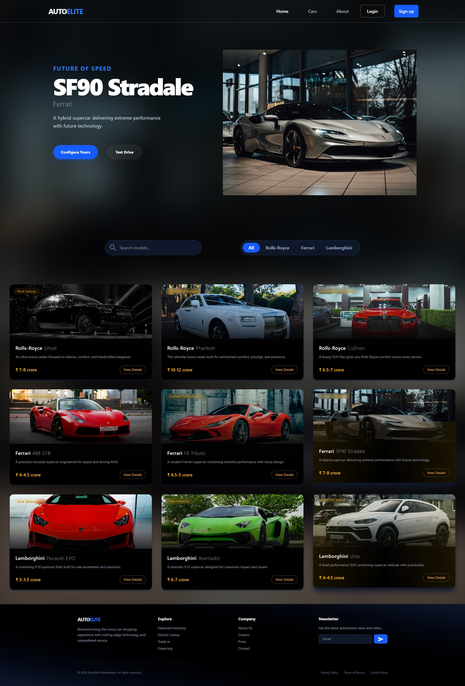
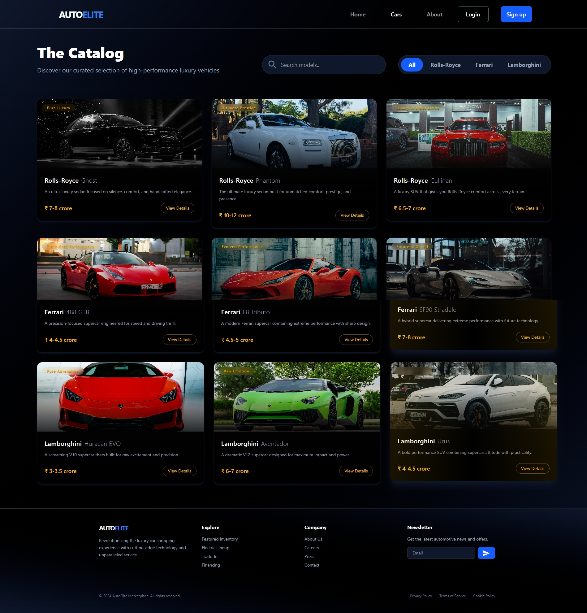
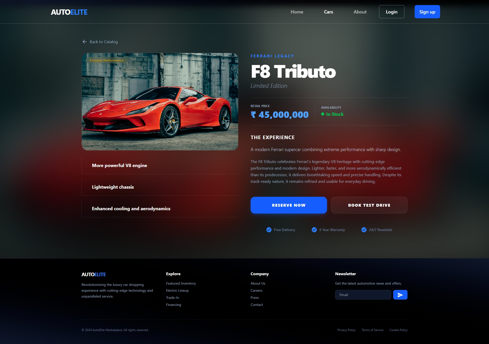
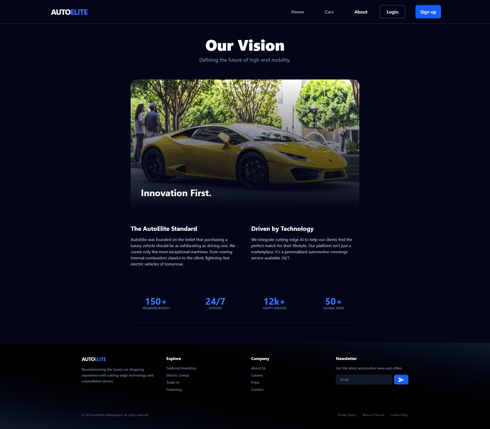
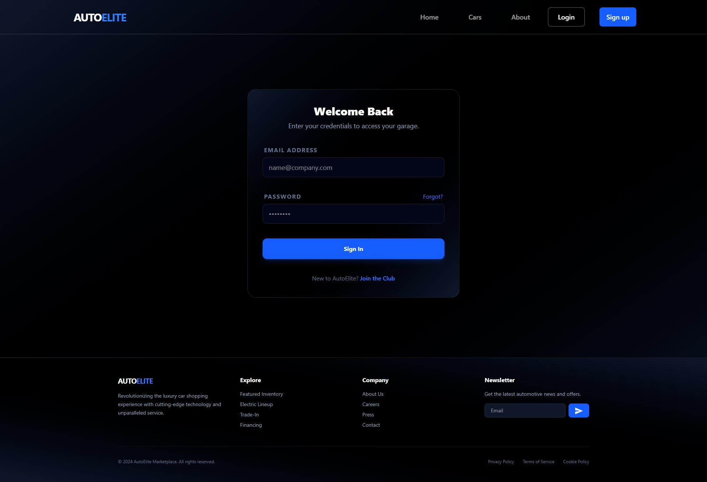
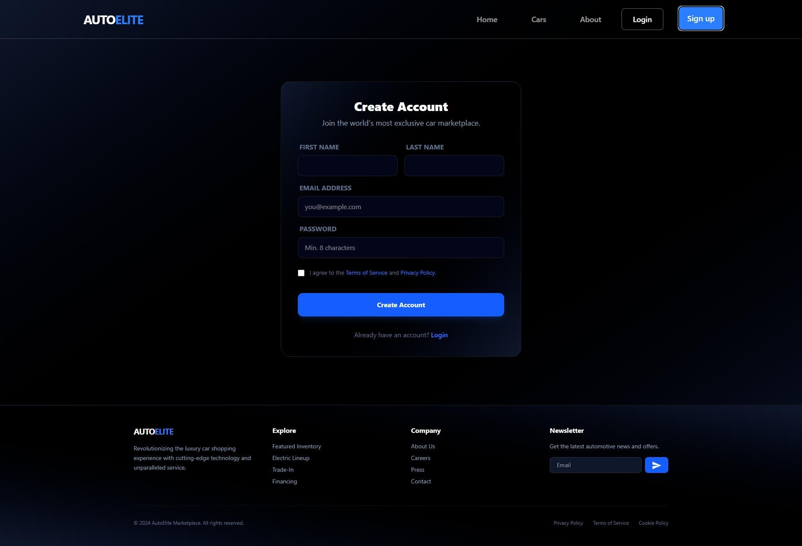
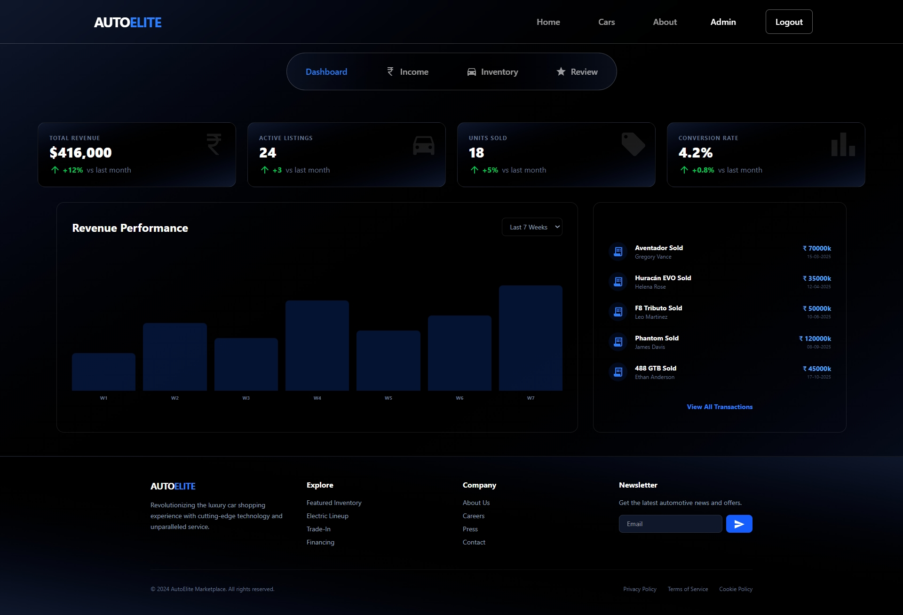

# 🚘 AutoElite - Luxury Car Showcase

AutoElite is a modern luxury car showcase web application built with React, React Router, Tailwind CSS, and Framer Motion.

The platform allows users to browse premium vehicles, explore detailed specifications, search luxury brands, and experience a visually immersive interface inspired by high-end automotive dealerships.

> ⚠️ **Work In Progress**
>
> This project is currently under active development. Features, pages, and functionality may change as development continues.

---

# 🚀 Live Demo

🔗 **Live Website:** [live@netlify](https://al-react-router.netlify.app/)

---

# 📸 Project Screenshots

## 🏠 Home Page



---

## 🚘 Cars Collection



---

## 📋 Car Details Page



---

## ℹ️ About Page



---

## 🔐 Login Page



---

## 👤 Sign Up Page



---

## 🛠️ Admin Dashboard



---

# ✨ Features

## User Features

- Browse luxury vehicles
- Responsive modern interface
- Vehicle detail pages
- Search functionality
- Brand filtering
- Smooth page transitions
- Animated UI interactions
- Mobile-friendly design

---

## Admin Features (Frontend)

- Dashboard overview
- Inventory management UI
- Customer review management UI
- Income tracking UI
- Protected route implementation

---

# 🛠️ Tech Stack

## Frontend

- React 19
- React Router DOM
- Tailwind CSS
- Framer Motion
- Material UI Icons
- React Helmet
- React Slick Carousel

---

# 📂 Project Structure

```bash
src/
│
├── component/
│   ├── cards/
│   ├── layout/
│   ├── adminLayout/
│   └── ui/
│
├── context/
│
├── data/
│
├── pages/
│   ├── Home
│   ├── Cars
│   ├── About
│   ├── Login
│   ├── SignUp
│   ├── CarSinglePage
│   │
│   └── admin/
│       ├── Dashboard
│       ├── Inventory
│       ├── Income
│       └── Review
│
├── App.jsx
└── main.jsx
```

---

# ⚙️ Installation

## Clone Repository

```bash
git https://github.com/AljuSabu/react_router
```

---

## Navigate Into Project

```bash
cd react_router-main
```

---

## Install Dependencies

```bash
npm install
```

---

## Run Development Server

```bash
npm run dev
```

---

## Build Production Version

```bash
npm run build
```

---

# 🎨 UI Highlights

- Premium luxury-inspired design
- Dark-themed modern interface
- Interactive hover effects
- Full-screen vehicle showcases
- Animated page transitions
- Responsive layouts
- Dynamic search experience

---

# 🔒 Authentication

Current authentication implementation includes:

- Login page UI
- Signup page UI
- Protected routes
- Context API authentication state

> Authentication is currently frontend-only and intended for future backend integration.

---

# 🚧 Planned Features

- Backend integration
- Real authentication system
- Database support
- Vehicle booking system
- User profiles
- Wishlist functionality
- Admin CRUD operations
- Payment integration
- Vehicle comparison system
- Contact & inquiry system

---

# 📱 Responsive Design

Optimized for:

- Mobile Devices
- Tablets
- Laptops
- Desktop Screens
- Ultra-Wide Displays

---

# 👨‍💻 Author

## Alju Sabu

- GitHub: https://github.com/AljuSabu

---

# ⭐ Support

If you like this project, consider giving it a ⭐ on GitHub.

---

## ⚠️ Project Status

This project is currently a **Work In Progress (WIP)**.

Several planned features are still under development, including backend integration and complete admin functionality.
